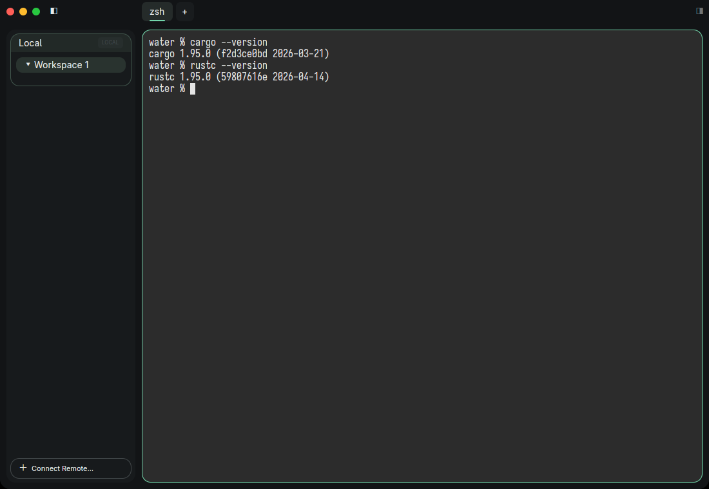
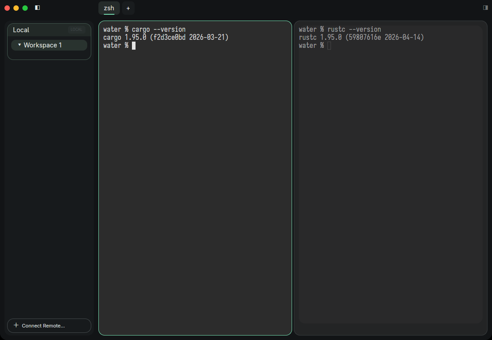

# Water

Water is a native Rust workbench for people who run local shells, remote build environments, and coding agents side by side. It keeps workspaces, terminal panes, server sessions, and agent status in one controllable desktop surface instead of treating each terminal as a disposable window.



The UI is deliberately quiet: a connection sidebar on the left, tabs above the active surface, and a terminal that stays attached to the server session that owns it. Terminals use Sarasa Term SC by default, with a graphite-and-jade theme across the workspace.



## What Water is for

- Local workspaces with tabs, split panes, real shells, selection/copy, scrollback, hyperlinks, and configurable keyboard shortcuts.
- SSH connections that bring remote workspaces into the same sidebar, with reconnect/offline state and matching embedded server payloads.
- Coding-agent detection and session labels that make active terminal sessions easier to find without creating a separate agent surface.
- A versioned `water ctl` control API for automation, smoke tests, state inspection, terminal queries, and real GUI actions.

## Start here

The packaged product targets macOS first. The repository also supports Linux development builds; the screenshots above show the default workspace appearance.

```sh
cargo run --bin water
```

For setup, configuration, remote connections, control commands, tests, cross-builds, and signing, see [docs/Documents.md](docs/Documents.md). The current module boundaries are in [ARCHITECTURE.md](ARCHITECTURE.md), and the complete configuration schema is in [config.example.json](config.example.json).

## Project status

Water is an active workbench rather than a compatibility layer for an existing terminal app. The server owns sessions and bounded terminal replay; each client attaches its own emulator and UI state. That separation is what enables persistent remote sessions, reliable reconnect, bounded output memory, and deterministic control/API tests.

## License

MIT OR Apache-2.0.
